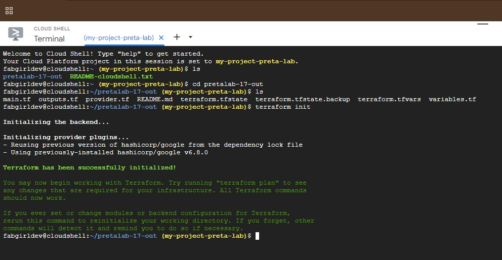
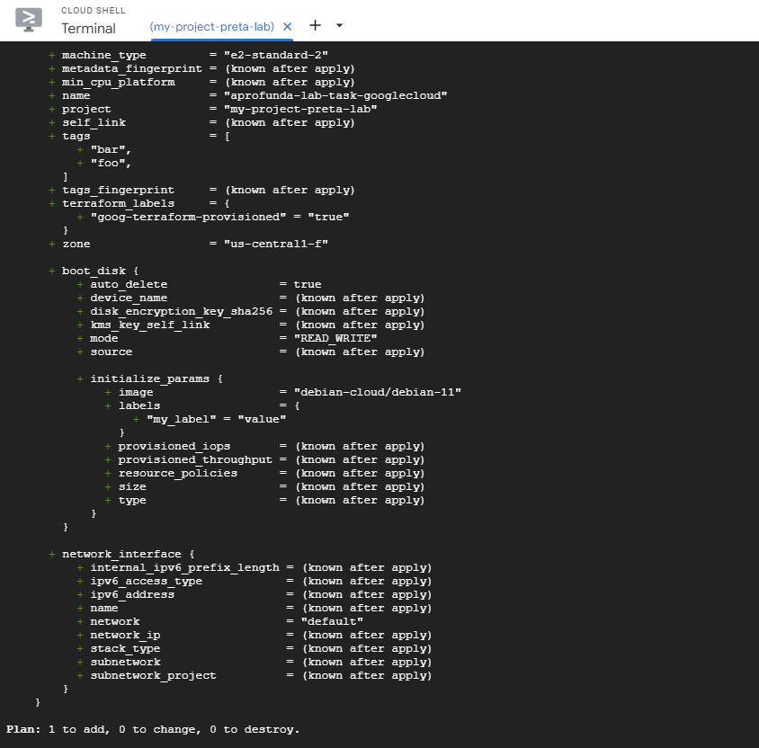
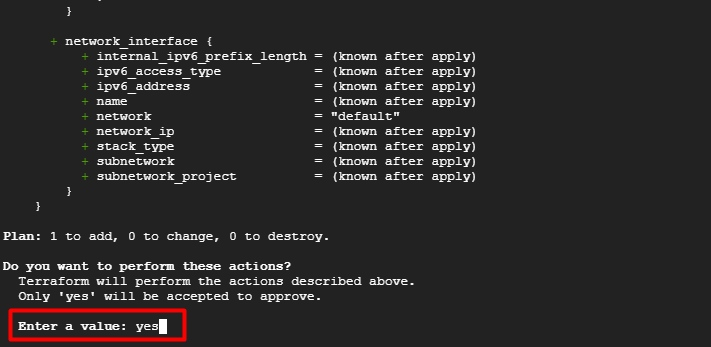
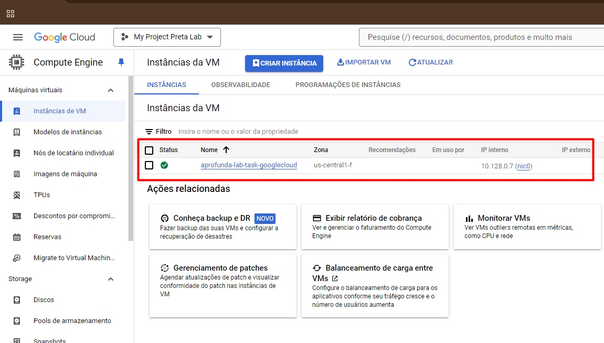

# Principais Tópicos Estudados:
- Introdução ao Google Cloud Platform (GCP);
- Serverless e Google Cloud Functions.

## Tipos de Computação em Nuvem:
Nuvem Pública: Comparável a uma biblioteca pública, com recursos compartilhados entre várias empresas, como oferecido por Google ou Amazon;
Nuvem Privada: Uma infraestrutura de uso exclusivo da empresa, com maior controle e segurança;
Nuvem Híbrida: Combinação dos dois, permitindo flexibilidade para atender a diferentes necessidades.

## Infraestrutura como Código (IaC):
- IaC simplifica a criação e gerenciamento de infraestrutura por meio de código, assim como seguir uma receita para montar servidores e redes automaticamente;
- gcloud permite gerenciar recursos no Google Cloud através de comandos, funcionando como um "controle remoto" para o Google Cloud.
- Máquinas Virtuais e Monolitos:

## Máquinas Virtuais (VMs): 
- São como "caixas" dentro de um datacenter, onde você usa uma parte da capacidade computacional para rodar suas aplicações;
- Monolito: Sistemas inteiros dentro de um bloco único. Embora fácil de começar, são difíceis de manter e escalar conforme crescem.

## DevOps e Pipelines:
Pipeline de DevOps: 
Processo automatizado que transforma o código em software pronto para ser usado, passando por fases de build, teste e deploy;
Build: Processo de compilar o código-fonte em uma aplicação executável;
Deploy: O momento de disponibilizar o software ao público, como "publicar um vídeo no YouTube."

## Tecnologias e Ferramentas: 🚀
- Google Cloud Platform (GCP): Para entender o uso de recursos como Compute Engine, App Engine, e Cloud Functions;
- Terraform: Introdução à automação da infraestrutura, com arquivos como main.tf, outputs.tf, variables.tf, e provider.tf;
- gcloud: Ferramenta de linha de comando para gerenciar recursos do Google Cloud;

## Documentações Consultadas:
- Compute Engine;
- App Engine
- Terraform

## Prints da criação de nova VM : 🧪
Inicialização da VM com Tarraform init: ⏬

Planejamento da VM com Tarraform plan: ⏬

"Sim" o planejamento sugerido da VM: ⏬

Aplicação com Tarraform apply: ⏬

### Print do Compute engine com VM criada com sucesso:
VM  criada com sucesso. ⏬

## O que Estudei Esta Semana:  📚🤓💻
Esta semana, estudei conceitos fundamentais sobre computação em nuvem, infraestrutura como código (IaC), virtualização, e o uso de ferramentas como Terraform e Google Cloud Platform (GCP). Aprendi como esses recursos se aplicam na prática para automatizar e gerenciar infraestruturas de TI.

